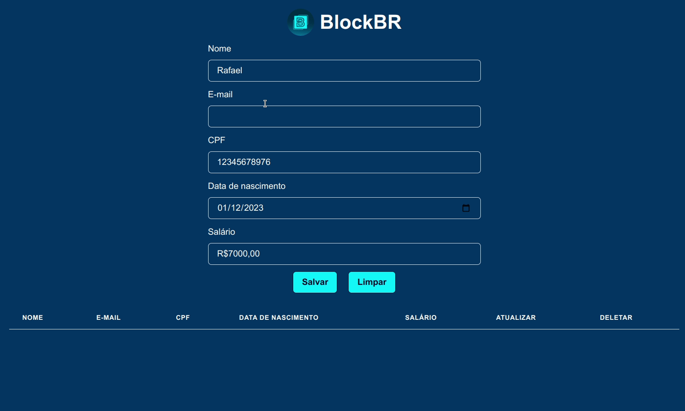

# Blockbr

## Preview 👀



## About 🔎

This is an api based in typeorm node and typescript.

## Tech tools 🔧

The following tools and frameworks were used in the construction of the project:<br>

<p>
  
  
  
  
  
  
  
  
  
  
  
  
  
  
  
  
</p>

## How to run ⚙️

1. Clone this repository
2. Install dependencies

```bash
yarn install
```

3. Create postgres db and assign to DB_NAME in env file
4. Run migrations

```bash
yarn migration:run
```

5. You can optionally build the project running

```bash
yarn dev
```

6. Finally add PORT in env or get access by default in http://localhost:4000
